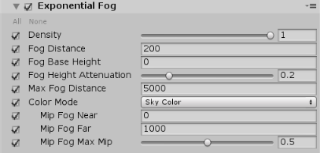

# Exponential Fog

The High Definition Render Pipeline (HDRP) provides a type of [fog](Fog-Overview.html) called Exponential Fog. Exponential Fog enables you to increase the density of the fog exponentially from the Camera position until it reaches a maximum density at a distance which you can customize. This produces more realistic fog effects than [Linear Fog](Override-Linear-Fog.html).

## Using Exponential Fog

**Exponential Fog** uses the [Volume](Volumes.html) framework, so to enable and modify **Exponential Fog** properties, you must add an **Exponential Fog** override to a [Volume](Volumes.html) in your Scene. To add **Exponential Fog** to a Volume:

1. Select the Volume component in the Scene or Hierarchy to view it in the Inspector.
2. In the Inspector, navigate to **Add Override > Fog** and click on **Exponential Fog**.

After you add an **Exponential Fog** override, you must set the Volume to use **Exponential Fog**. The [Visual Environment](Override-Visual-Environment.html) override controls which type of fog the Volume uses. In the **Visual Environment** override, navigate to the **Fog** section and set the **Type** to **Exponential Fog**. HDRP now renders **Exponential Fog** for any Camera this Volume affects.

## Properties

| **Property**               | **Description**                                              |
| -------------------------- | ------------------------------------------------------------ |
| **Density**                | Use the slider to set the maximum density of the fog. This acts as a global multiplier. Higher values produce thicker fog. |
| **Fog Distance**           | The distance from the Camera at which the fog density roughly reaches the value you set in **Density**. Because the attenuation curve for the fog density is exponential, this is not the precise distance at which the density is at its maximum value. |
| **Fog Base Height**        | The height (in world space) at which the fog density begins to decrease. |
| **Fog Height Attenuation** | Use the slider to set the speed at which the density of the fog decreases with height (in world space). |
| **Max Fog Distance**       | The maximum distance of the fog from the Camera.             |
| **Color Mode**             | Use the drop-down to select the mode HDRP uses to calculate the color of the fog. **Sky Color**: HDRP shades the fog with a color it samples from the sky cubemap and its mip maps. **Constant Color**: HDRP shades the fog with the color you set manually in the **Constant Color** field that appears when you select this option. |
| **Mip Fog Near**           | The distance (in meters) from the Camera that HDRP stops sampling the lowest resolution mip map for the fog color. This property only appears when you set **Color Mode** to **Sky Color**. |
| **Mip Fog Far**            | The distance (in meters) from the Camera that HDRP starts sampling the highest resolution mip map for the fog color. This property only appears when you set **Color Mode** to **Sky Color**. |
| **Mip Fog Max Mip**        | Use the slider to set the maximum mip map that HDRP uses for the mip fog. This defines the mip map that HDRP samples for distances greater than **Mip Fog Far**. This property only appears when you set **Color Mode** to **Sky Color**. |
| **Constant Color**         | Use the color picker to select the color of the fog. This property only appears when you set **Color Mode** to **Constant Color**. |